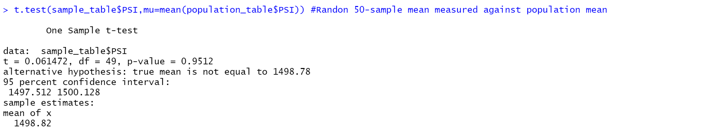

# MechaCar_Statistical_Analysis - Module 15 Challenge 

## 4 Deliverables:
    1. Linear Regression to Predict MPG
    2. Summary Statistics on Suspension Coils
    3. T-Test on Suspension Coils
    4. Design a Statistical Study Comparing the MechaCar to the Competition

## Input Files:
    1. MechaCar_MPG (csv dataset)
    2. Suspension_Coil (csv dataset)

### Deliverable 1: Perform Multiple Linear Regression using Significance Level = 0.05 for independent variables.
    * Dependent variable: miles per gallon (mpg).
    * Independent variables: vehicle_length, vehicle_weight, spoiler_angle, ground_clearance, & AWD.
    * Imported MechaCar_mpg.csv file and output to dataframe named "MechaCar_mpg_data"
    * "lm(mpg ~ vehicle_length + vehicle_weight + spoiler_angle + ground_clearance + AWD,data=MechaCar_mpg_data)"
    * "summary(lm(mpg ~ vehicle_length + vehicle_weight + spoiler_angle + ground_clearance + AWD,data=MechaCar_mpg_data))"
    * vehicle_length and ground_cleareance provided non-random amounts of variance to mpg; p-values < 0.05.
    * slope (m) of vehicle_length = 6.27 and slope (m) of ground_clearance = 3.55.
    * the y-intercept = -1.04
    * intercept p-value < 0.05, which may indicate that other independent variable(s) may be excluded from dataset.
    * R^2 = 0.71, which is a high coefficient of determination.
    * See screenshots below for regression and summary outputs.

### Deliverable 2: Perform Mean, Median, Variance, and SD measurements on PSI column using population and Lot sample datasets.
    * Imported Suspension_Coil.csv file and output to dataframe named "demo_table"
    * Created "total_summary" dataframe to create the Mean, Median, Variance, and SD using the PSI values from the total lot Population.
    * "total_summary <- demo_table %>% summarize(Mean=mean(PSI), Median=median(PSI), Variance = sd(PSI)*sd(PSI), SD=sd(PSI),  .groups = 'keep') #create summary table"
    * Created "lot_summary" dataframe to create the Mean, Median, Variance, and SD values using the PSI values for each Manufacturing_Lot.
    * "lot_summary <- demo_table %>% group_by(Manufacturing_Lot) %>% summarize(Mean=mean(PSI), Median=median(PSI), Variance = sd(PSI)*sd(PSI), SD=sd(PSI),  .groups = 'keep')"
    * The population mean in the "total_summary" dataframe is 1498.78.
    * The sample means for Lot1, Lot2, and Lot3 in the "lot_summary" dataframe are 1500.00, 1500.20, and 1496.14, respectively.
    * See attached screenshots showing "total_summary" and "lot_summary" dataframes.

### Deliverable 3: Perform four 1-sample t-tests comparing means random samples, Lot1, Lot2, & Lot3 samples to population mean.
    * Note that Deliverable 3 instruction stated the population mean as 1500, which is INCORRECT. Deliverable 2 shows a population mean of 1498.78.
    * The instructions in Module 15.6.2 calls for the calculated population mean in the 1-sample t-test formula. I used the calculated population mean for all four t-tests.
    * H0: There is no statistical difference between sample mean & population mean.
    * Ha: There is a statistical difference between sample mean & population mean.
    * "population_table <- read.csv(file='Suspension_Coil.csv',check.names=F,stringsAsFactors = F)"
    * "sample_table <- population_table %>% sample_n(50)" This command generates the ramdon sample table.
    * "LOT1 <- subset(population_table,Manufacturing_Lot=="Lot1")" This command generated the LOT1 sample table.
    * "LOT2 <- subset(population_table,Manufacturing_Lot=="Lot2")" This command generated the LOT2 sample table.
    * "LOT3 <- subset(population_table,Manufacturing_Lot=="Lot3")" This command generated the LOT3 sample table.
    * "t.test(sample_table$PSI,mu=mean(population_table$PSI)) #Command for Random 50-sample mean measured against population mean"
    * "t.test(Lot1$PSI,mu=mean(population_table$PSI)) # Command for Lot1 50-sample mean measured against population mean"
    * "t.test(Lot2$PSI,mu=mean(population_table$PSI)) # Command for Lot2 50-sample mean measured against population mean"
    * "t.test(Lot3$PSI,mu=mean(population_table$PSI)) # Command for Lot3 50-sample mean measured against population mean"
    * t-tests for Lot1 & Lot2 have p-values < 0.05, which rejects null hypothesis.
    * t-tests for random sample and Lot3 have p-values > 0.05 and do not reject null hypothesis. 
    * Lot3 t-test results shows significant quality control problems. The lot_summary for Lot3 in Deliverable 2 also shows high variance & SD.
    * See attached screenshots for t-tests.

### Deliverable 4: Design a Study Comparing the MechaCar to the Competition.
    
## Study Design: MechaCar vs Competion.
    * Construct a population with same-class car models from MechaCar & other manufacturers - 300 sample minimum.
    * Use car_length, ground_clearance, horsepower, & number_of_cylinders as the independent variables.
    * Use mpg as the dependent variable.
    * Run multiple linear regression using the dependent variable and ALL of the independent variables. 
    * The independent variables with p-values below a significance level of 0.05 will contribute minimal variance and will most strongly influence mpg.
    * Multiple linear regression should have R^2 >= 0.70 for high confidence test.
    * Run 1-sample t-test using mpg mean from random samples of 50 against population mpg mean.
    * Run 1-sample t-test using mpg mean from only MechaCar models against population mpg mean.
    * Run 1-sample t-tests using mpg means from each competitor models against population mpg mean.
    * Check p-values from t-test using random samples. Is p < 0.05?
    * Check p-values from t-test using MechaCar samples. Is p < 0.05?
    * Check p-values from t-tests using individual competitor samples. Is p < 0.05?
    * The results from the multiple linear regression should help determine which independent variables influence mpg.
    * The results from the t-tests should help to determine which manufacturer has best mpg for population class.

